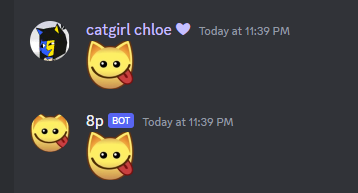
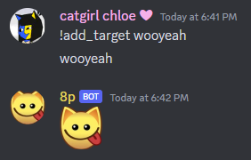

<h1 align='center'>8p</h1>
<p align='center'>
    
</p>
A Discord bot for Torpedo Ted’s  Authentic Australian Steakhouse and Bar and Grill. It is always 8p'ing :3
<p align='center'>
    
</p>


## Commands

To remove a target phrase (a phrase which triggers the bot to respond with :8p:) an admin can say

```
<PREFIX>remove_target <phrase>
```

To add a target phrase


```
<PREFIX>add_target <phrase>
```

for example
<p align='center'>
    
</p>


The set of target phrases is stored on disk in src/targets.out, in this way it persists across sessions.